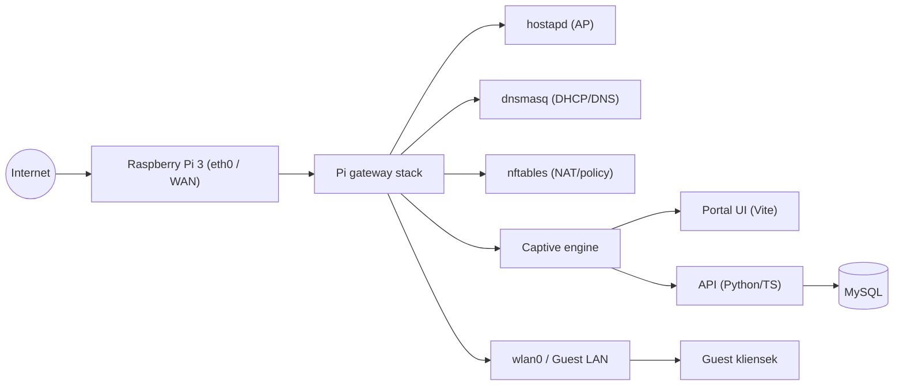

# Topológia (lab)

```mermaid
graph LR
  Internet(("Internet")) --> ETH0["Raspberry Pi 3 (eth0 / WAN)"]
  ETH0 --> Router["Pi gateway stack"]
  Router --> Hostapd["hostapd (AP)"]
  Router --> Dnsmasq["dnsmasq (DHCP/DNS)"]
  Router --> Nft["nftables (NAT/policy)"]
  Router --> Captive["Captive engine"]
  Captive --> Portal["Portal UI (Vite)"]
  Captive --> API["API (Python/TS)"]
  API --> MySQL[("MySQL")]
  Router --> WLAN0["wlan0 / Guest LAN"]
  WLAN0 --> Clients["Guest kliensek"]
```
