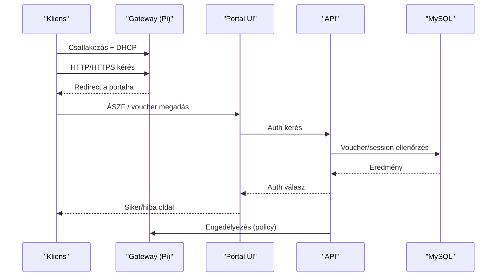

# Captive portal folyamat

```mermaid
sequenceDiagram
  participant Client as "Kliens"
  participant Gateway as "Gateway (Pi)"
  participant Portal as "Portal UI"
  participant API as "API"
  participant DB as "MySQL"

  Client->>Gateway: Csatlakozás + DHCP
  Client->>Gateway: HTTP/HTTPS kérés
  Gateway-->>Client: Redirect a portalra
  Client->>Portal: ÁSZF / voucher megadás
  Portal->>API: Auth kérés
  API->>DB: Voucher/session ellenőrzés
  DB-->>API: Eredmény
  API-->>Portal: Auth válasz
  Portal-->>Client: Siker/hiba oldal
  API->>Gateway: Engedélyezés (policy)
```
